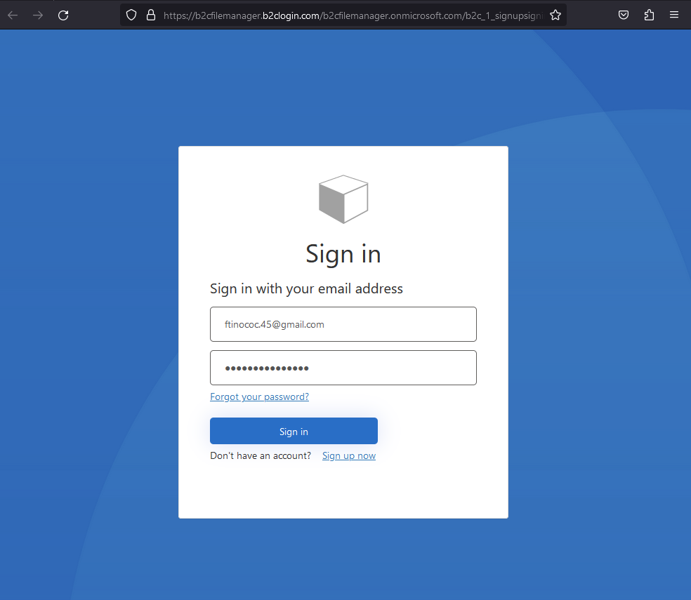
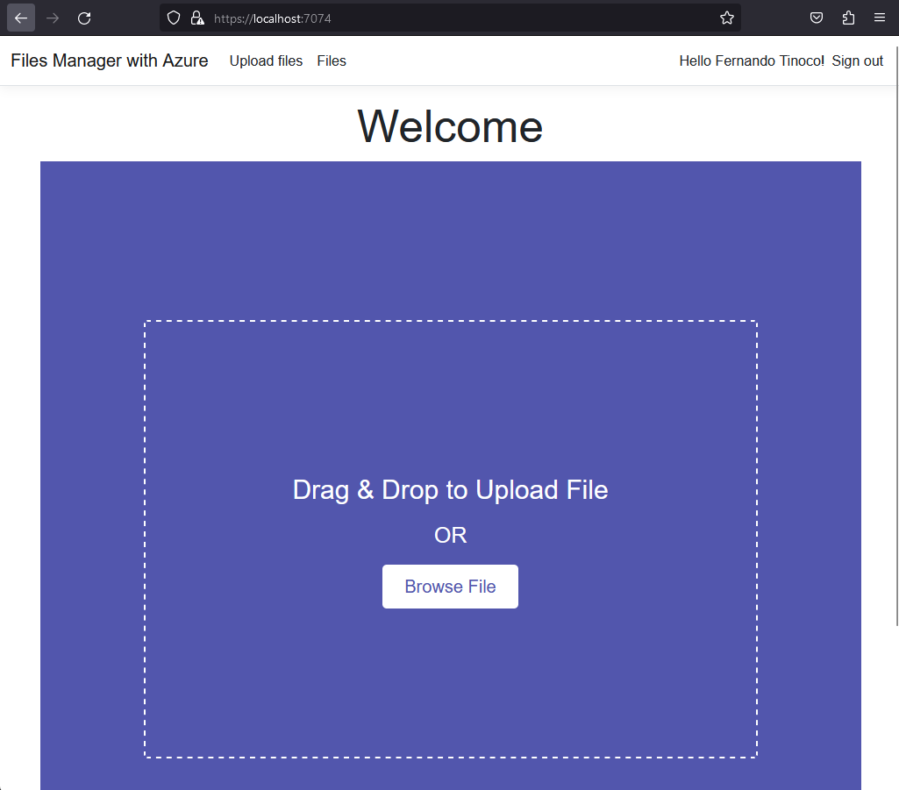
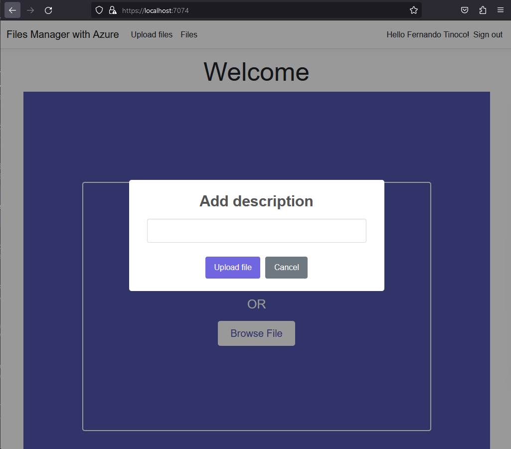
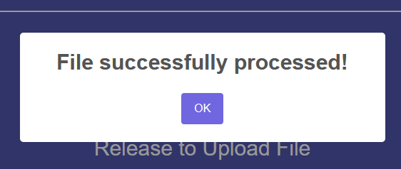

# FilesManagerWithAzure
This is a solution developed with ASP.NET MVC/.NET6 integrated with Azure AD B2C, Azure Blob Storage, Azure Cosmos DB and is deployed in Azure App Service. I tried to structure the projects based on responsability:
- Core: The logic and database connection are here. 
- API: Web application that show the functionality to user.

## Getting started

- Cloning code
```
git clone https://github.com/ftinoco/files-manager-with-azure.git
```

- Build the whole solution in order to install all packages.
- The connection to Azure services is already configured in appsettings.json, so there is no need to add another configuration.
- Run the **FilesManagerWithAzure.APP** project and it should display a login screen. 

## Screens
Once the application is built and running, a login screen will be displayed as follows:

Here we can register by entering our e-mail address, password and name, after which we are ready to log in. Once logged in we will see a screen as follows:

As we can see, we have the option to load the file by dragging and dropping the file into the purple space or by clicking the Browse File button. After file is selected, a confirmation dialog box like the one below will appear, asking for the file description:

If we try to upload the file without a description, we will get a validation message, indicating that the description is required.

Once the description has been entered, the file upload will be processed.

If it's all okay, we will see a success message, like this:

And finally we will be able to see the list of files uploaded:


## Availability

The application is available through [FilesManagerWithAzureApp](https://file-manager-app.azurewebsites.net/).